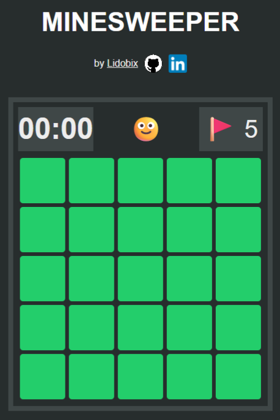
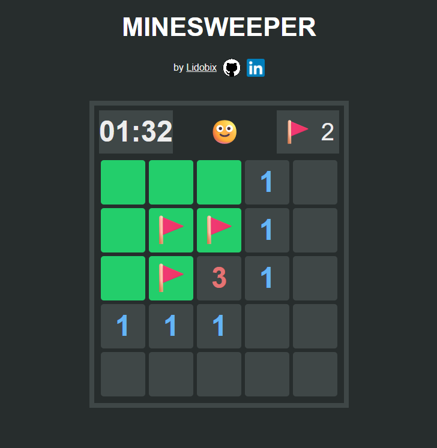

# 💣 MineSweeper

Ce projet réalisé avec NextJS reproduit la mécanique du jeu Démineur diffusé à travers les OS Windoxs des années 90/2000.
**Objectif**: Découvrir toutes les mines cachées sous les cases de la grille sans cliquer sur une case piégée.

### Aperçus:

## Stack:

- NextJS
- Typescript

## Installation:

`npm install`

`npm run dev`

Jeu disponible sur `http://localhost:3000`

## Fonctionnalités:

- Définition d'une grille de jeu 5x5 avec 5 mines placées aléatoirement.
- Possibilité de déposer un flag sur les cases susceptibles de cacher une mine.
- Actions por déposer/retirer un flag:
  - **Mobile**: appui long
  - **Desktop**: clic droit.
- La première case sélectionnée ne cache pas de mine.
- Jeu chronométré.
- Nouvelle partie en cliquant sur le smiley.

## Statut projet:

Side project assez avancé, l'objectif était de reproduire fidèlement les règles du jeu d'origine en utilisant les contextes/hooks de react, optimiser les mises à jour du statut des cases ainsi que celui de la partie (en cours/gagné/perdu).

**Updates prévus:**

- Optimisation du responsive.
- Ajout d'un sélecteur de niveaux.

**Lidobix**
